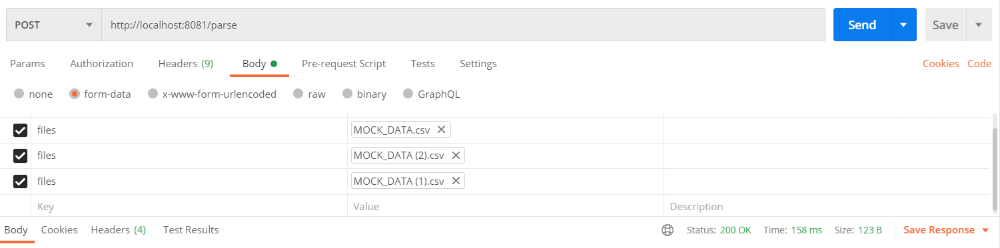
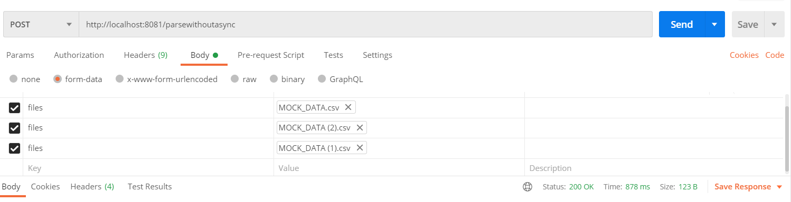

# MultiThreading in Spring Boot
I always lacked implementing multithreading concepts , but had known the importance of it so decided to give it a try

## Need
Consuming large amounts of data from any source takes a lot of time , but here is 
multithreading helping us in some way  

## Approach

In this project , I did make use of an in memory database for testing and then tried
to read three CSV files in the format (username,password) , each containing
1000 records and then saved them in the database.

## Results

#### Using Async (multithreading)

Making use of Async and having maximum three threads got me the result in 158 ms

#### Without Using Async 

Making use of Async and having maximum three threads got me the result in 878 ms

